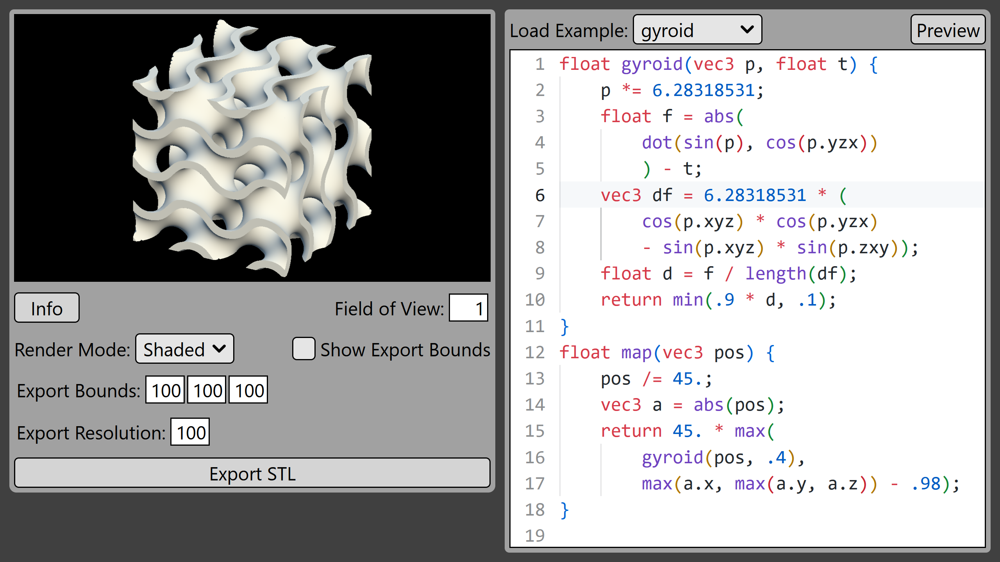
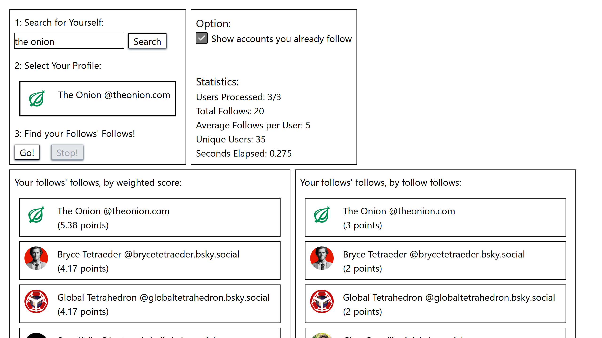
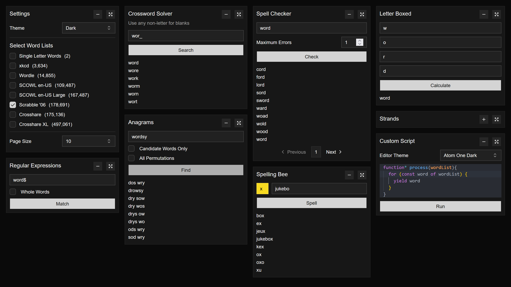

# [sdf2stl.saej.in](https://sdf2stl.saej.in/)

An editor for designing and 3d printing mathematically defined objects.

3D computer graphics.

# [followsfollows.saej.in](https://followsfollows.saej.in)

Find who your followed Bluesky accounts follow.

Performance tuning, memory optimization, streaming algorithms.

# [words.saej.in](https://words.saej.in/)

A collection of word-related tools.
Useful for solving crosswords, finding anagrams, and making word puzzles of your own.
Parallel processing, information theory, string algorithms, and library design.

# Other Works

[LinkedIn](https://www.linkedin.com/in/pvillan/) [GitHub](https://github.com/pvillano) [Printables](https://www.printables.com/social/114452-pvillano/about) [Shadertoy](https://www.shadertoy.com/user/pvillano)
