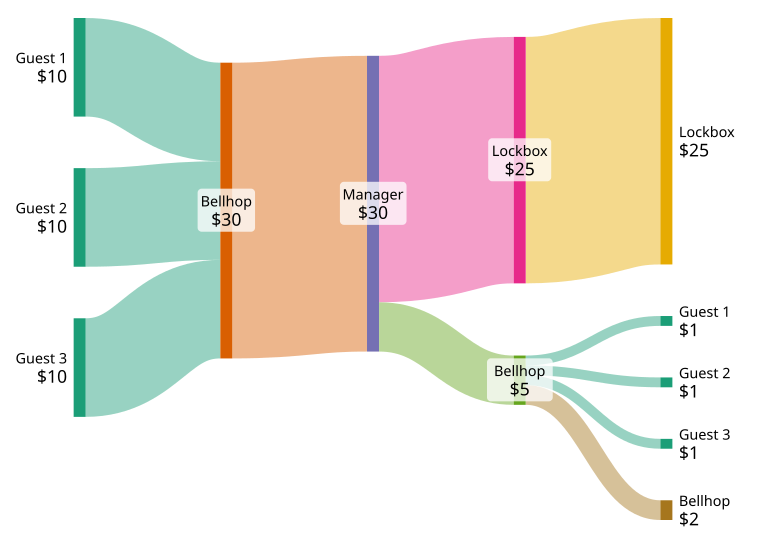
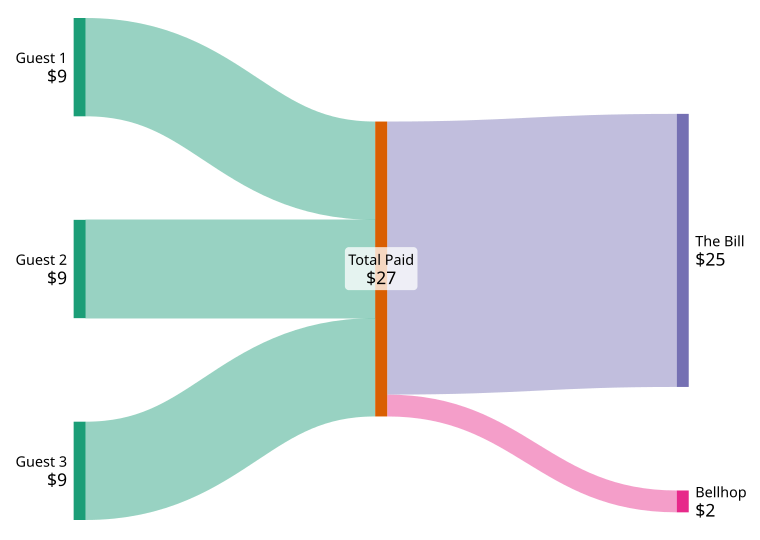

Growing up, I lived far from my grandparents,
so I only saw them a couple of times a year, for holidays.
Every time I visited, my grandfather would tell me the same riddle.

> Three guests check into a hotel room.
The manager says the bill is $30, so each guest pays $10.
Later the manager realizes the bill should only have been $25.
To rectify this, he gives the bellhop $5 as five one-dollar bills to return to the guests.
>
> On the way to the guests' room to refund the money,
the bellhop realizes that he cannot equally divide the five one-dollar bills among the three guests.
As the guests are not aware of the total of the revised bill,
the bellhop decides to just give each guest $1 back and keep $2 as a tip for himself,
and proceeds to do so.
>
> As each guest got $1 back, each guest only paid $9, bringing the total paid to $27.
The bellhop kept $2, which when added to the $27, comes to $29.
So if the guests originally handed over $30, what happened to the remaining $1?[^wikisrc]

I learned only recently that he would ask me this riddle
because he legitimately did not know the answer.
My father remembers the man discussing it at length
with his buddies at the racquetball court,
none of them quite sure where the missing dollar went.

Pause ~~the video~~ here and try to solve the riddle yourself before continuing.[^nothing]



We can trace the exact flow of money with the following diagram.
Every column of vertical bars is a point in time.
At all times there is exactly $30.
In each transition, $30 flows in and $30 flows out,
so money is never lost.
Indeed, the sum of allocations on the end is the full $30.
Nothing is missing.

We can also construct a simplified diagram to show the exact error in the final paragraph.
$2 should not be added to $27, it should be subtracted from $27.
$27 leave the wallets of the guests,
$2 enter the wallet of the bellhop,
and $25 go to the hotel.

[I bring new meaning to a ROUGH draft]

My grandfather passed away before I started working for the real estate investor
who would introduce me to Sankey diagrams.
I never got the chance to 

My grandfather knew how to make the best meatballs, arancini, [...] and croquettes.
He knew how to be a loving father, grandfather, and great-grandfather.
He knew how much his family loved and would miss him.

Just not the answer to a dumb accounting riddle.



[^wikisrc]: Exact wording copied from Wikipedia ["Missing dollar riddle"](https://en.wikipedia.org/wiki/Missing_dollar_riddle)
[^nothing]: I don't have a backend; the form does nothing except reveal the rest of the article.
