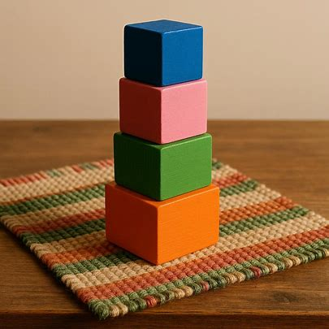
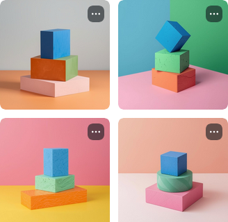

A response to Alex O'Connor's [Why ChatGPT Can't Draw a Full Glass of Wine](https://www.youtube.com/watch?v=160F8F8mXlo)

> "A study of cats showed that the brain must be exposed to certain sights early in life, or it will remain blind to those sights forever." [^1]

The rest of the problem is the difference between a simple impression
and the actual process of perceiving a color.

I would describe the process of perceiving a color as follows:

1.  TODO 
2.  TODO 
3.  TODO 
4.  TODO 
5.  This is where optical illusions take place. Gaps are filled with heuristics that sometimes fail. 
6.  sensor fusion, plus working memory knowledge of the situation 
7.  TODO 
8.  Language is the serialization of thought 

What I would say the real reason ChatGPT can't draw a full glass of wine is that 

I won't claim to understand how knowledge is represented in the brain.

But, consider the images generated with the following prompt:

> "blue block on a red block on a pink block on a green block on an orange block on a rug on a table"

| Bing                                                      | Canva                                            |
|-----------------------------------------------------------|--------------------------------------------------|
|  |  |

Maybe Google's video generator one can make a full glass of wine.

[^1]: [Psychology Today, "The Cat Nobel Prize Part II"](https://www.psychologytoday.com/us/blog/brain-food/201404/the-cat-nobel-prize-part-ii)
